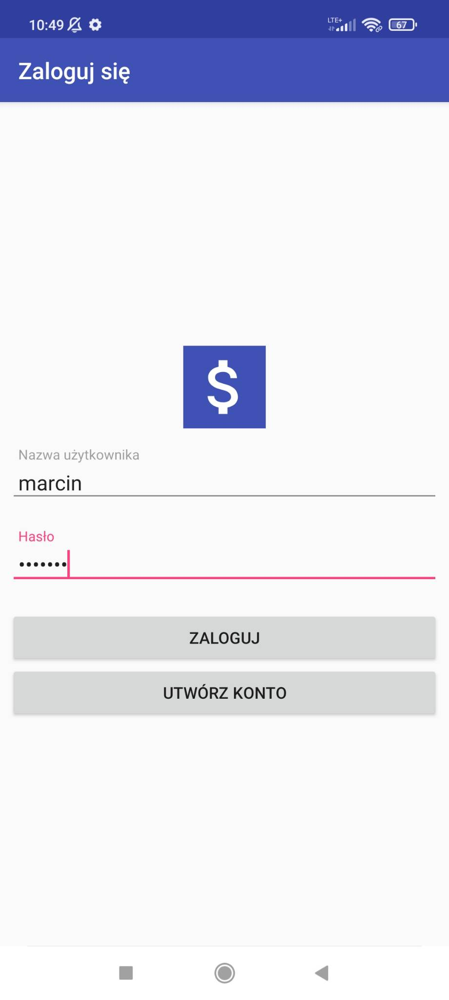
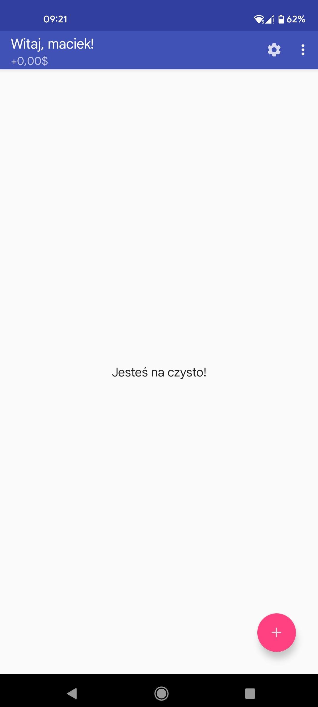
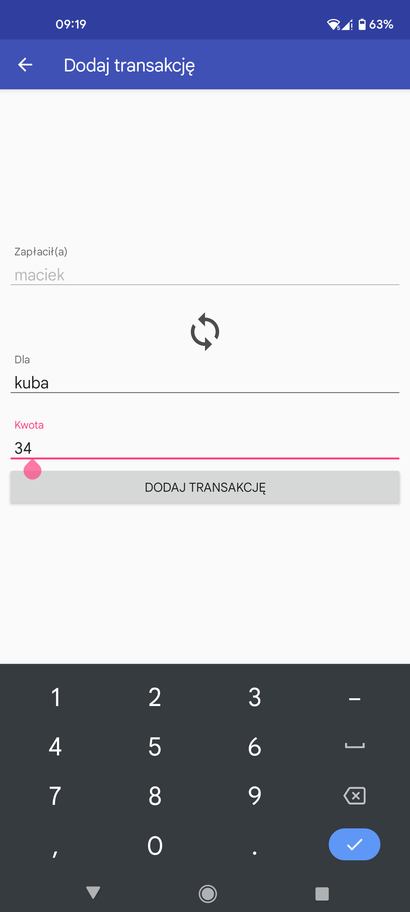
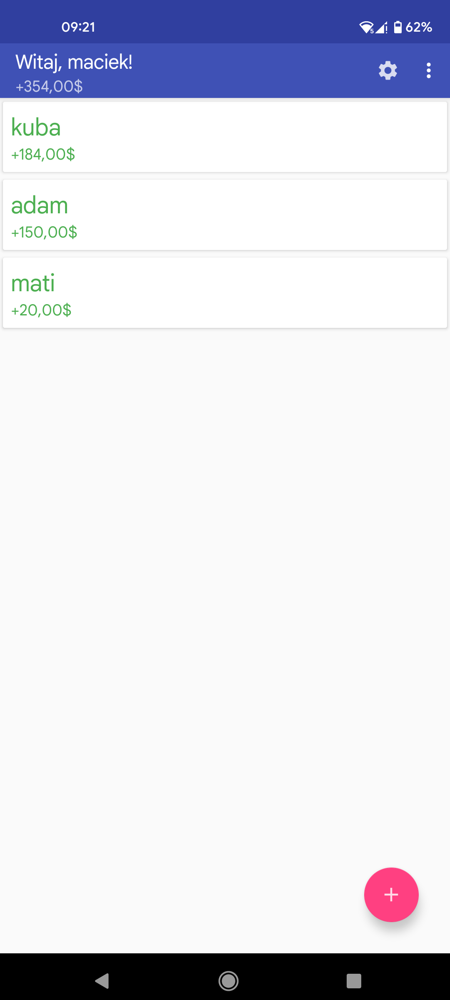
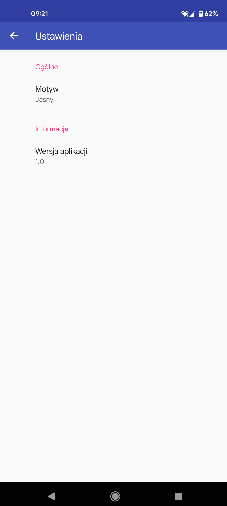
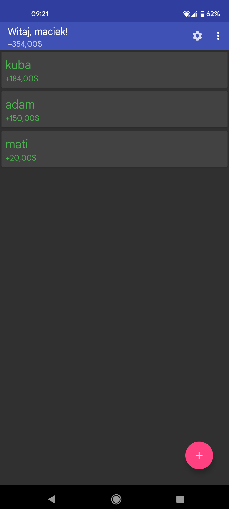

# APRO2 ROZLICZANIE WSPÓLNYCH WYDATKÓW

## Wstęp

Aplikacja IOUCash jest aplikacją Androidową do rozliczania wydatków w grupach osób. Jej działanie można porównać z czymś na wzór
znanej aplikacji Splitwise.

## Działanie

### Logowanie i rejestracja

Po zainstalowaniu i uruchomieniu aplikacji użytkownikowi ukazuje się ekran logowania. Tutaj użytkownik może
zdecydować się utworzyć konto wpisując żądany login i hasło. W momencie rejestracji dane te zostają dodane do
bazy danych, przy czym hasło jest hashowane. Jeśli inny użytkownik użył już żądanej nazwy użytkownika, rejestracja
nie dochodzi do skutku.
Gdy użytkownik próbuje się zalogować, baza danych jest sprawdzana, czy konto istnieje, sprawdzana jest poprawność
hasła, jeśli wszystko się zgadza to logowanie przebiega poprawnie i aplikacja przechodzi do ekranu głównego.

### Transakcje

Ekran główny pokazuje bilans użytkownika - kwoty, które jest winny innym użytkownikom, bądź kwoty, które inni
są mu winni.

Główną funkcją aplikacji jest dodawanie transakcji - tutaj są dwie możliwości:

- takie, w których użytkownik zapłacił za kogoś innego
- i takie, w których ktoś zapłacił za użytkownika

Po dodaniu transakcji serwer przelicza bilanse użytkowników i ustawia pokazuje na ich ekranach długi tak, żeby
rozliczenie się między nimi zajęło jak najmniejszą liczbę przelewów.

### Ustawienia

Aplikacja posiada również ekran ustawień. Można w nim zobaczyć aktualną wersję oprogramowania, oraz zmieniać
motyw pomiędzy jasnym i ciemnym (bazowo jest ustawiany motyw zgodny z systemowym).

